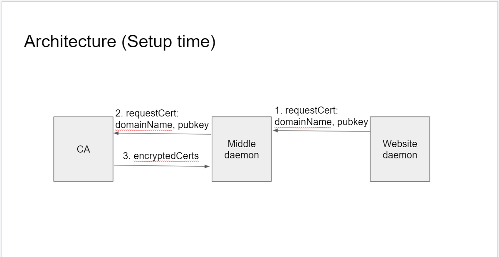
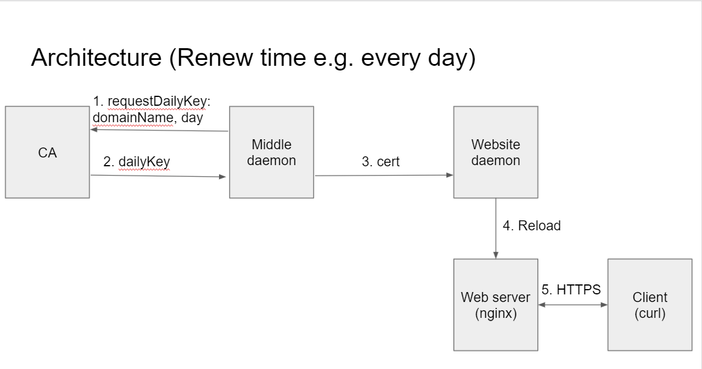

# short-lived-cert

## Overview

short-lived-cert is an implementation that extends the [Towards Short-Lived Certificates](https://www.ieee-security.org/TC/W2SP/2012/papers/w2sp12-final9.pdf) paper to accommodate [Certificate Transparency](https://certificate.transparency.dev/) implementation.

## Setup

```
$ pip3 install merklelib
$ cd CA/script
$ go mod download
```

## Build

```
$ cd <CA or middle-daemon or website-daemon>/script
$ go build
```

## Run

### CA

To create encrypted certificates and generate a daily key, run the following:

```
$ ./CA [masterkey] 
...
Listening to daily key request...
issue [domain_name]
key [domain_name] [num_of_day]
```

### Middle daemon

To decrypt a certificate, run the following:

```
./Middle-daemon
...
Listening to certificate request...
[domain_name] [num_of_day]
```

### Website daemon: 

To verify a certificate, run the following:

```
./Website-daemon
...
Listening to request...
[domain_name] [num_of_day]
```

## Architecture




